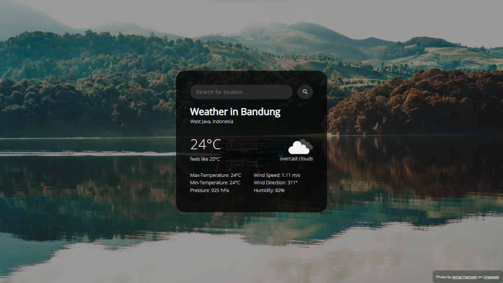
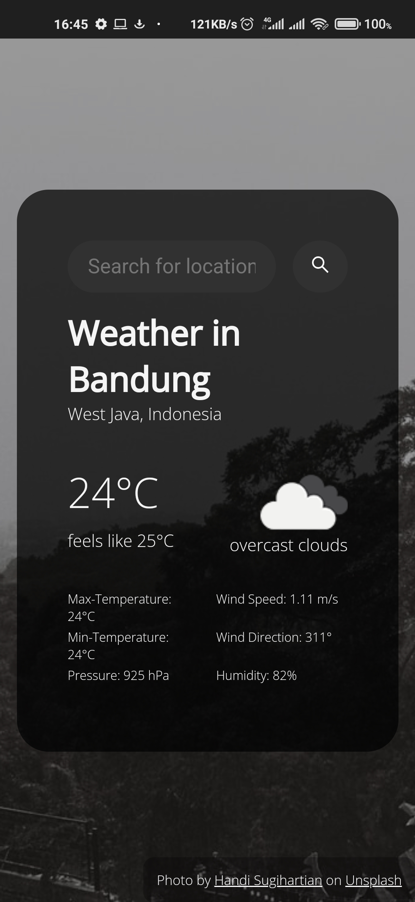

# Responsive Weather web application

Hello, so I made this weather web application utilizing these API from [Open Weather map](https://openweathermap.org) and [Unsplash](https://unsplash.com), it's fully responsive on most kind of devices. this web app was made for learning project using Fetch API javascript, Async/await, and a little bit of css transition/animation.

if you interested to check this website you can click here [https://refara08-web-app.pages.dev](https://refara08-weather-web-app.pages.dev). and I would appreciate any suggestion or feedback from you 😊.

Thank you for visiting this repo. I hope you like it!.

## Screenshot

## Author

- Frontend Mentor - [@Refara08](https://www.frontendmentor.io/profile/Refara08)
- Github - [Refara08](https://github.com/Refara08)
- Codepen - [Gema Refantero](https://codepen.io/refantero)
- Twitter - [@GRefantero](https://twitter.com/GRefantero)
